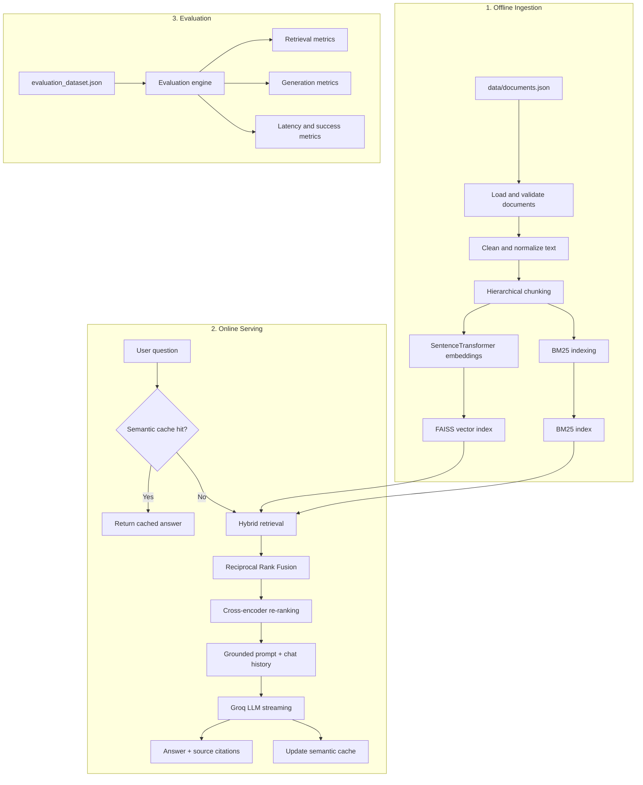

# 🍽️ Zomato RAG Customer Support Chatbot

<p align="center">
  <strong>An intelligent, retrieval-grounded customer support assistant for Zomato-related questions.</strong><br>
  Ask about orders, cancellations, refunds, payments, Zomato Gold, food safety, and customer support policies.
</p>

<p align="center">
  
  
  
  
  
  
  
</p>

---

## 📌 Project Overview

The **Zomato RAG Customer Support Chatbot** is an end-to-end Generative AI application built using **Retrieval-Augmented Generation (RAG)**.

The chatbot retrieves relevant information from a curated knowledge base of publicly available Zomato documentation and uses that context to generate concise, friendly, and grounded customer-support responses.

Unlike a general-purpose LLM that may invent policy details, this application is designed to answer using retrieved source content and provide source citations for transparency.

> **Important:** This is an educational portfolio project. It does not connect to Zomato's private systems, live order database, payment accounts, delivery tracking systems, or internal support tools.

## ✨ Key Features

- ⚡ **Real-time LLM streaming** for a responsive chat experience.
- 🌓 **Dual-theme Streamlit UI** with light and dark modes.
- 💬 **Chat view** with branded banner, topic pills, message history, and conversational responses.
- 💡 **Sample Questions view** with curated questions and one-click “Ask Now” actions.
- ⚙️ **Settings view** for Top-K tuning, model selection, cache controls, and transcript export.
- ℹ️ **About view** containing architecture details and evaluation information.
- 🔀 **Hybrid retrieval** using dense FAISS search and sparse BM25 search.
- 🧩 **Reciprocal Rank Fusion (RRF)** to combine dense and sparse rankings.
- 🔬 **Cross-encoder re-ranking** for improved retrieval precision.
- 💾 **Semantic caching** for repeated or paraphrased questions.
- 🛡️ **Self-healing vector store** that can build indexes automatically when missing.
- 📥 **One-click transcript export** in Markdown format.
- 🧾 **Collapsible source citations** for retrieved policy documents.
- 🧪 **Evaluation suite** for measuring retrieval and answer quality.

## 🧠 System Architecture



## 🛠️ Technology Stack

| Layer | Technology | Purpose |
|---|---|---|
| Programming language | Python 3.10+ | Application and pipeline development |
| Frontend | Streamlit | Interactive customer-support interface |
| Dense retrieval | FAISS CPU | Vector similarity search |
| Sparse retrieval | BM25 / `rank-bm25` | Exact keyword and phrase matching |
| Embeddings | `sentence-transformers/all-MiniLM-L6-v2` | Local 384-dimensional text embeddings |
| Re-ranking | `cross-encoder/ms-marco-MiniLM-L-6-v2` | Query–document relevance scoring |
| LLM | Groq API | Response generation and token streaming |
| LLM client | OpenAI-compatible client | Communication with the Groq API |
| Configuration | `python-dotenv` | Environment variable management |
| Data processing | pandas | Evaluation reports and exports |
| Evaluation | Custom Python evaluator | Retrieval and response-quality analysis |

## 📁 Project Structure

```text
zomato-rag-assistant/
│
├── data/
│   ├── documents.json
│   ├── evaluation_dataset.json
│   ├── evaluation_results.json
│   └── evaluation_results.csv
│
├── vectorstore/
│   └── faiss_index/
│       ├── index.faiss
│       ├── metadata.pkl
│       └── bm25.pkl
│
├── src/
│   ├── __init__.py
│   ├── config.py
│   ├── ingest.py
│   ├── rag.py
│   └── evaluation.py
│
├── app.py
├── requirements.txt
├── .env
├── .env.example
├── .gitignore
└── README.md
```

## 📚 Data Sources and Knowledge Base

The knowledge base is stored in:

```text
data/documents.json
```

It contains publicly available Zomato-related documentation covering seven policy domains:

1. **Cancellation and Refund Policy**
2. **Ordering and Delivery Terms**
3. **Zomato Gold Membership**
4. **Payment Methods and Failed Transactions**
5. **Food Safety and Merchant Standards**
6. **Customer Support and Grievance Redressal**
7. **Account Terms and Security**

Each document contains metadata such as:

- `document_id`
- `title`
- `category`
- `source_type`
- `source_name`
- `source_url`
- `content`

This metadata is preserved throughout the ingestion and retrieval pipeline so that the chatbot can display traceable source references.

## 🔄 Ingestion and Indexing Pipeline

The ingestion process is handled by:

```bash
python src/ingest.py
```

The process performs the following steps:

1. Loads and validates `data/documents.json`.
2. Cleans excess whitespace and control characters.
3. Splits documents into meaningful chunks.
4. Generates local embeddings using Sentence Transformers.
5. Builds a FAISS vector index.
6. Builds a BM25 sparse keyword index.
7. Saves the indexes and chunk metadata under `vectorstore/faiss_index/`.

The application can also rebuild the indexes automatically during startup if they are missing.

## ✂️ Hierarchical Chunking Strategy

The project uses hierarchical chunking to preserve the meaning of policy content.

```text
Paragraphs
    ↓
Bullet points
    ↓
Sentences
    ↓
Words
```

Default configuration:

- **Chunk size:** 700 characters
- **Chunk overlap:** 120 characters

The overlap helps prevent important policy statements from being separated at chunk boundaries.

Each chunk retains:

- `chunk_id`
- Parent `document_id`
- Document title
- Category
- Source URL

## 🔍 Hybrid Retrieval

The chatbot combines two retrieval methods.

### 1. Dense Retrieval with FAISS

Sentence Transformers convert text chunks into 384-dimensional vectors. FAISS searches for chunks that are semantically similar to the user's question.

Normalized embeddings and inner-product similarity are used to approximate cosine similarity efficiently.

### 2. Sparse Retrieval with BM25

BM25 improves retrieval for exact terms, acronyms, and policy-specific values such as:

- FSSAI
- ₹199
- OTP
- UPI
- GST invoice
- Grievance Officer

### 3. Reciprocal Rank Fusion

The dense and sparse result lists are merged using Reciprocal Rank Fusion:

\[
RRF(d) = \sum_m \frac{1}{k + rank_m(d)}
\]

This allows the system to benefit from both semantic meaning and exact keyword matching.

## 🔬 Cross-Encoder Re-Ranking

After hybrid retrieval, the candidate chunks are re-ranked using:

```text
cross-encoder/ms-marco-MiniLM-L-6-v2
```

The cross-encoder evaluates the query and each candidate chunk together:

\[
Score = CrossEncoder(Query, Chunk)
\]

This helps promote the most relevant passages before they are passed to the LLM.

## 💾 Semantic Caching

The application includes an in-memory semantic cache to reduce repeated LLM calls.

For each incoming question:

1. The question is converted into an embedding.
2. Its similarity to previously cached questions is calculated.
3. If similarity is greater than or equal to `0.90`, a cached response may be returned.
4. The UI displays an `⚡ Instant Reply` indicator for cache hits.

Semantic caching can reduce latency and API usage for repeated or paraphrased questions.

## 🤖 LLM Engine and Response Style

The application uses the Groq API through an OpenAI-compatible client.

The assistant is instructed to:

- Respond like a professional Zomato customer-support agent.
- Use only retrieved context.
- Keep answers concise and directly relevant.
- Use short paragraphs or bullet points when helpful.
- Avoid unnecessary technical explanations.
- Politely reject unsupported or out-of-scope questions.
- Never invent refund timelines, policy rules, delivery guarantees, or account-specific information.
- Never claim access to live orders, private accounts, or internal databases.

The UI supports real-time token streaming so that responses appear progressively rather than waiting for the entire answer.

## 🧾 Source Citations and Provenance

Each response can include a collapsible source section such as:

```text
📄 Sources (2)

1. Zomato Cancellation and Refund Policy ↗
2. Payments and Refunds - Help Center ↗
```

Source information is deduplicated and displayed in a user-friendly format.

For out-of-scope questions, citations are suppressed when no meaningful source exists.

## 📊 RAG Evaluation

Run the evaluation suite using:

```bash
python src/evaluation.py
```

The evaluation dataset contains 15 diverse benchmark questions across the supported policy domains.

### Evaluation Metrics

| Metric | Description |
|---|---|
| Retrieval Hit Rate / Recall@K | Whether the relevant document appears in the top-K retrieved results |
| Context Precision | How much of the retrieved context is relevant |
| Context Recall | Whether the required information was retrieved |
| Faithfulness | Whether generated claims are supported by retrieved context |
| Answer Relevancy | Whether the answer directly addresses the question |
| Ground-truth semantic match | Similarity between the generated answer and reference answer |
| Average latency | Time taken to generate a response |
| Success rate | Percentage of evaluation questions completed successfully |

Evaluation results can be saved as:

```text
data/evaluation_results.json
data/evaluation_results.csv
```

> Evaluation scores should be regenerated whenever the documents, prompt, retrieval configuration, or model changes.

## 🚀 Installation and Local Setup

### Prerequisites

- Python 3.10, 3.11, or 3.12
- A Groq API key
- Internet access for downloading embedding and re-ranking models on first use

### 1. Clone the repository

```bash
git clone https://github.com/<your-username>/zomato-rag-assistant.git
cd zomato-rag-assistant
```

### 2. Create a virtual environment

```bash
python -m venv .venv
```

Activate the environment.

**Windows:**

```bash
.venv\Scripts\activate
```

**macOS/Linux:**

```bash
source .venv/bin/activate
```

### 3. Install dependencies

```bash
pip install -r requirements.txt
```

### 4. Configure the API key

Create a `.env` file in the project root:

```env
GROK_API_KEY=your_actual_groq_api_key_here
GROQ_API_KEY=your_actual_groq_api_key_here
GROK_MODEL=groq/compound-mini
```

Never commit `.env` to GitHub.

## ▶️ Running the Application

### Step 1: Build the indexes

```bash
python src/ingest.py
```

### Step 2: Launch Streamlit

```bash
streamlit run app.py
```

Open the local URL shown in the terminal, usually:

```text
http://localhost:8501
```

### Step 3: Run the evaluation benchmark

```bash
python src/evaluation.py
```

## ☁️ Deployment on GitHub and Streamlit Community Cloud

### 1. Push the project to GitHub

```bash
git init
git add .
git commit -m "feat: complete Zomato RAG customer support assistant"
git branch -M main
git remote add origin https://github.com/<your-username>/zomato-rag-assistant.git
git push -u origin main
```

### 2. Deploy on Streamlit Community Cloud

1. Open [Streamlit Community Cloud](https://share.streamlit.io/).
2. Sign in with GitHub.
3. Select **New app**.
4. Choose the repository and `main` branch.
5. Set the main file path to:

   ```text
   app.py
   ```

6. Open the app's **Secrets** settings.
7. Add the following TOML configuration:

```toml
GROK_API_KEY = "gsk_your_groq_api_key_here"
GROQ_API_KEY = "gsk_your_groq_api_key_here"
GROK_MODEL = "groq/compound-mini"
```

8. Save the secrets and deploy.

The application can rebuild missing FAISS and BM25 indexes from `data/documents.json` during startup.

## 💬 Example Questions

### In-scope questions

- Can I cancel my order once the kitchen starts cooking?
- How long does a refund take for UPI versus credit-card payments?
- What happens if I do not answer the delivery partner's phone call?
- What delivery and dining discounts are included with Zomato Gold?
- Can I change my delivery address after placing an order?
- How do I report damaged food?
- Where can I download my GST tax invoice?

### Semantic cache test

Ask:

1. “What is the refund timeline for UPI?”
2. “How long does a UPI refund take?”

The second question may be served from the semantic cache if it meets the configured similarity threshold.

### Out-of-scope questions

- What is the recipe for chicken biryani?
- What will the weather be in Delhi tomorrow?

The assistant should politely explain that these questions are outside the available knowledge base.

## ⚠️ Limitations

- **No live order database:** The chatbot cannot inspect actual orders, driver locations, user profiles, or payment accounts.
- **Static knowledge base:** Answers are limited to the documents included in `data/documents.json`.
- **Policy freshness:** Documents must be updated and re-indexed when official policies change.
- **Local storage:** FAISS and BM25 are stored locally and are not designed for large distributed workloads.
- **Free-tier limits:** Groq API usage may be subject to request, token, or daily limits.
- **Evaluation dependency:** Results depend on the quality and coverage of the benchmark dataset and reference answers.

## 🔮 Future Improvements

- Add automatic document refresh and scheduled re-indexing.
- Implement conversation-aware query rewriting for follow-up questions.
- Add multilingual support, including Hindi and other Indian languages.
- Add voice input and speech output.
- Integrate human-agent escalation using Zendesk or Freshdesk.
- Support image uploads for damaged-food complaints.
- Add persistent chat history and user feedback storage.
- Add Docker-based deployment.
- Introduce automated regression tests for retrieval and prompt changes.
- Add monitoring for latency, token usage, errors, and retrieval failures.

## 🎯 Portfolio Value

This project demonstrates practical skills in:

- Retrieval-Augmented Generation
- Data cleaning and document chunking
- Local embedding generation
- Vector indexing with FAISS
- Sparse retrieval using BM25
- Reciprocal Rank Fusion
- Cross-encoder re-ranking
- Prompt engineering
- LLM API integration
- Streaming responses
- Semantic caching
- Source attribution
- RAG evaluation
- Streamlit application development

It can be presented as a portfolio project for:

- Generative AI Engineer
- AI/ML Engineer
- Applied NLP Engineer
- Data Scientist
- Machine Learning Engineer

## 👨‍💻 Author
Pranay Kale

Built as an educational and portfolio-focused project to explore practical Retrieval-Augmented Generation systems and customer-support automation.

---

<p align="center">
  <strong>Made with ❤️ for learning, experimentation, and better customer support experiences.</strong>
</p>
